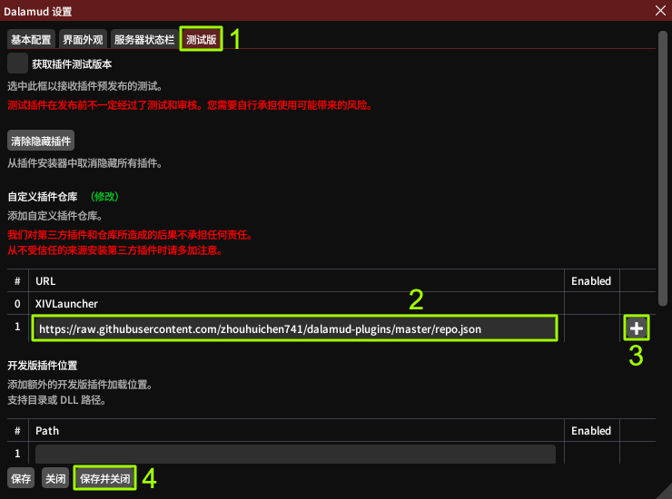

<div align="center">

# Dalamud 汉化插件仓库

**2488652el 的个人 FF14 卫月（Dalamud）插件仓库**

精选插件 · 完整简体中文汉化 · 随国服版本持续跟进

[](https://github.com/goatcorp/Dalamud)
[](repo.json)
[](repo.json)
[](https://github.com/2488652el/dalamud-plugins/commits/master)
[](https://github.com/2488652el/dalamud-plugins/stargazers)

</div>

---

## 📦 仓库地址

在卫月「自定义插件仓库」中添加以下地址即可订阅本仓库，一次订阅，永久获取全部汉化插件及后续更新：

```
https://raw.githubusercontent.com/2488652el/dalamud-plugins/master/repo.json
```

> 订阅方式见下方[安装教程](#-安装教程)。

## ✨ 收录插件

以下插件均为本仓库**自行汉化并编译**的版本，全部界面与提示文本已翻译为简体中文，术语与国服客户端保持一致：

| 图标 | 插件 | 版本 | 说明 |
| :--: | --- | :--: | --- |
|  | **Browsingway（汉化版）** | 1.7.2 | 在游戏内渲染浏览器悬浮窗，全屏游戏同时使用 ACT 悬浮窗、网页视频等 |
|  | **Item Vendor Location（汉化版）** | 2.14.0.1 | 为物品添加右键菜单，显示可从哪些商人处购买/兑换该物品 |
| – | **Mini-Mappingway（汉化版）** | 15.750.1.4 | 在小地图上显示好友和部队成员，可自定义标记样式与显示范围 |
|  | **Visland（汉化版）** | 1.0.0.0 | 自动化无人岛的各项事务：自动采集、工坊安排等 |

> 汉化仅涉及用户可见文本，插件功能与原版保持一致；署名中的原作者保留全部权利。

## 🔍 插件详情

### Browsingway（汉化版）

在游戏内渲染基于 Chromium 的浏览器悬浮窗，全屏（及 G-SYNC）游戏的同时也能正常使用 ACT 悬浮窗、看网页视频、浏览任意网站。

- 支持 DPI 缩放、缩放倍率、不透明度、帧率逐项调节
- 静音、禁用、隐藏、脱战隐藏、PvP 隐藏一应俱全
- 鼠标穿透 / 键盘穿透 / 锁定 / 全屏模式，支持自定义 CSS 注入
- ACT/IINACT 专属优化：ACT 未运行时自动禁用悬浮窗
- 聊天指令：`/bw config` 打开设置窗口；`/bw overlay [指令名] [设置项] [值]` 通过聊天栏修改设置
- 首次使用会自动下载 CEF 浏览器依赖组件（体积较大，托管于 GitHub，带 SHA256 校验）
- 源码：[2488652el/Browsingway-cn](https://github.com/2488652el/Browsingway-cn)

### Item Vendor Location（汉化版）

查物品出处的利器。为可从商人处获得的物品添加右键菜单，一键列出所有出售该物品的商人及其位置，并将坐标发送到聊天栏。

- 物品提示框直接标注军票 / 特殊货币兑换价格，无需打开商店逐个翻页
- 右键菜单即可查询，支持「商人列表」与「直接发送坐标」两种展示方式
- 聊天指令：`/pvendor` 打开设置窗口；`/pvendor 青磷水` 按名称搜索物品（不区分大小写）
- 源码：[2488652el/ItemVendorLocation-cn](https://github.com/2488652el/ItemVendorLocation-cn)

<p align="center">
  
  
</p>

### Mini-Mappingway（汉化版）

在小地图上一眼找到你的好友和部队成员，打本、逛金碟、海都挂机找人不再费劲。

- 分别设置 **好友**、**部队成员**、**所有人** 三类标记的颜色、圆点大小与描边
- 优先级数值高的标记会覆盖显示在低的之上
- 战斗与 PvP 场景下标记自动隐藏，不干扰战斗视野
- 聊天指令：`/mmway` 打开设置窗口
- 源码：[2488652el/MiniMappingway-cn](https://github.com/2488652el/MiniMappingway-cn)

> 提示：部队成员通过部队后缀（简称）识别，若你的部队后缀过于常见，建议在设置中关闭部队成员显示。

### Visland（汉化版）

无人岛自动化工具，把重复劳动交给插件。

- 自动采集：按预设路线自动跑点采集
- 工坊安排：自动排产、自动收取
- 更多无人岛事务持续覆盖中
- 原版 Wiki（路线预设等）：[ffxiv_visland Wiki](https://github.com/awgil/ffxiv_visland/wiki)

## 📥 安装教程

1. 在聊天框输入 `/xlsettings` 打开卫月设置菜单（或打开插件管理器后点击底部设置按钮）。
2. 切换到「**测试版**」选项卡。
3. 将上面的仓库地址粘贴到「**自定义插件仓库**」下的输入框中（最后一个框旁边有一个 `+`）。
4. 点击 `+` 按钮，然后点击「**保存并关闭**」。



之后在聊天框输入 `/xlplugins` 打开插件安装器，搜索插件名称即可安装。

## ❓ 常见问题

**插件如何更新？**
无需手动操作。卫月会定期检查仓库清单，发现新版本后插件安装器中会出现「更新」按钮，点击即可。

**下载很慢或失败？**
插件包托管于 GitHub，部分地区直连较慢。可尝试切换网络环境或使用加速工具后，在插件安装器中重试。

**游戏版本更新后插件提示不兼容？**
国服版本更新后，卫月框架与插件需要相应适配。请耐心等待更新推送，本仓库会在汉化版适配完成后第一时间跟进。

**如何卸载某个插件？**
在插件安装器（`/xlplugins`）的「已安装插件」中找到对应插件，点击卸载即可；不影响仓库订阅本身。

## 🔗 相关链接

- 插件源码（Browsingway 汉化版）：[2488652el/Browsingway-cn](https://github.com/2488652el/Browsingway-cn)
- 插件源码（ItemVendorLocation 汉化版）：[2488652el/ItemVendorLocation-cn](https://github.com/2488652el/ItemVendorLocation-cn)
- 插件源码（MiniMappingway 汉化版）：[2488652el/MiniMappingway-cn](https://github.com/2488652el/MiniMappingway-cn)
- 仓库清单文件：[repo.json](repo.json)
- 问题反馈：[Issues](https://github.com/2488652el/dalamud-plugins/issues)

## ⚠️ 免责声明

本仓库插件为第三方插件，仅供学习交流使用。使用第三方插件存在违反游戏用户协议的风险，请自行斟酌。如遇问题请先在原版插件仓库确认是否为原版问题，汉化相关问题欢迎通过 Issue 反馈。

---

<div align="center">

如果本仓库对你有帮助，欢迎点个 ⭐ Star 支持一下

</div>
